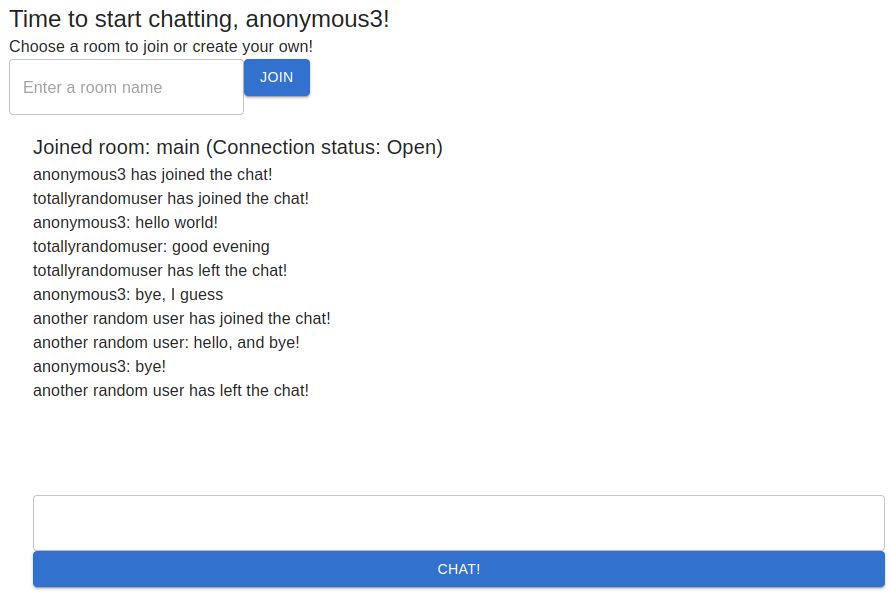

# Charoom with Salt



***

## Table of Contents

- [What is this](#what-is-this)
- [How to set it up](#how-to-set-it-up)
- [Pillar examples](#pillar-examples)
- [Bringing the chatroom up](#bringing-the-chatroom-up)
- [Internal architecture](#internal-architecture)
  - [chatroom/base/init.sls](#chatroombaseinitsls)
  - [chatroom/cert/init.sls](#chatroomcertinitsls)
  - [chatroom/frontend/frontend.conf](#chatroomfrontendfrontendconf)
  - [chatroom/frontend/init.sls](#chatroomfrontendinitsls)
  - [chatroom/backend/init.sls](#chatroombackendinitsls)

## What is this?

This is a repo meant for documentation of me practicing Salt. Here I've built a saltstack 
which will setup a live chatroom where users can, without registering, enter into
a chatroom and talk to other users connected via websockets. Users can create 
their own rooms or chat in the default main room where they are introduced to 
upon entering the chat service after choosing (or not choosing) a name.

## How to set it up?
To begin, this repository should be cloned into a directory where your salt master can reach
the .sls files. In my case this is in `/srv/salt`.

```bash
cd /srv/salt
git clone git@github.com:p-lemonish/chatroom-salt.git chatroom
```

Note that the directory should be named `chatroom`.

Then, for example into the home directory, clone my repositories `chatroom-react` 
and `chatroom-go`.

```bash
git clone git@github.com:p-lemonish/chatroom-go.git
git clone git@github.com:p-lemonish/chatroom-react.git
```

Go into the `chatroom-react`-directory and clean install & build. After it's done,
tarball the `dist`-directory and move it to `/srv/salt/chatroom/frontend`.

```bash
cd chatroom-react/
npm ci && npm run build
tar cvf dist.tar.gz dist
mv dist.tar.gz /srv/salt/chatroom/frontend/
```

Next go into `chatroom-go` and build the docker image, then tag it as dev or prod
depending on if you're deploying this image into production (on a server requiring ssl)
or locally (can use self signed certs).

After tagging, save it as `.tar` using 
`docker save` and give sufficient rights (mode 644), then move it to `/srv/salt/chatroom/backend`.

The example below sets the tag as `dev`. For prod, append `-prod` to the tarfile instead.

```bash
cd chatroom-go/
docker build -t chatroom-backend:latest .
docker tag chatroom-backend:latest chatroom-backend:dev
docker save chatroom-backend:dev -o chatroom-backend-dev.tar
chmod 644 chatroom-backend-dev.tar
mv chatroom-backend-dev.tar /srv/salt/chatroom/backend/
```

Before running the Salt state, we should check up with pillars.

### Pillar examples

Under `chatroom-salt/pillar/examples/` you’ll find four example files of pillars 

- `chatroom.sls` (shared SSL paths)
- `dev.sls` (dev mode and domain)
- `prod.sls` (prod mode and domain)
- `top.sls` (mapping minions -> pillar sets)

Copy them into your real pillar directory and edit the values as needed

```bash
cd /srv/pillar
cp /srv/salt/chatroom/pillar/examples/* ./
```

Then open both `dev.sls` / `prod.sls` and set your own domain and mode

```yaml
# dev.sls
chatroom:
  mode: dev
  domain: chatroom-dev-domain.com

# prod.sls
chatroom:
  mode: prod
  domain: chat.prod-domain.com
```

### Bringing the chatroom up

Your `top.sls` at `/srv/salt` should contain the following lines, to set the order 
in which the states are run

```yaml
base:
  'salt-minion':
    - chatroom.base
    - chatroom.cert
    - chatroom.frontend
    - chatroom.backend
```


Now assuming your minion is up and listening. Running the following
commands should run it all up. Replace `'salt-minion'` with your minion name if required.

```bash
sudo salt 'salt-minion' state.apply 
```

Next, if you're in dev and you're locally hosting the chatroom, add a temporary line in your `/etc/hosts`

```bash 
YOUR-MINION-IP chatroom-dev-domain.com
```

Now entering `chatroom-dev-domain.com` on the browser should present you with the 
starting page of the chatroom! Enter a name or leave it blank and press the "Chat!"
button to see the chatting interface. Next, this should be spun up on a server where
other people can also interact with the chat.

## Internal architecture

### chatroom/base/init.sls
The sole point of base is to initialize and configure Nginx in a default state, 
so that for a fresh instance with no certificates yet, it can fetch certificates 
from certbot. The `basenginx.conf` is the configuration file dropped to Nginx while 
this setup is going on. It simply makes sure the acme-challenge can be requested
from the server. After it's done the configuration file will be removed.

This was created because the `frontend.conf`, that is the actual configuration state
file we want to give Nginx, depends on a valid certificate, so otherwise it would be 
in a loop where frontend can't deploy because there is no certificate, but the 
certificate can't be obtained as there is no daemon serving for certbot.

Once the server has certificates, the job of base is done and shouldn't be needed 
anymore.

***

### chatroom/cert/init.sls
The job of this state file is to install Certbot and it's dependencies, generate 
valid certificates for the prod-domain and otherwise generate self-signed certificates
for a dev-domain using `openssl`.

***

### chatroom/frontend/frontend.conf
This configuration file will proxy the chatroom's endpoints to the backend, setting
headers such as the Upgrade header which will ensure the websocket connection can 
bet established. It also will redirect all HTTP -> HTTPS.

It uses data stored in the pillar to set the configuration file appropriately 
depending on if the server is deployed on dev or prod.

The React app will be served through static files stored in `/var/www/html/dist`.
The responsibility of filling this directory correctly is on `frontend/init.sls`.

***

### chatroom/frontend/init.sls
Will grab the `dist.tar.gz` stored in to the Salt server at `/srv/salt/chatroom`
and deploy it into `/var/www/html/dist`. It also initializes `frontend.conf` and 
restarts Nginx everytime the configuration file is updated.

***

### chatroom/backend/init.sls
Installs `python3-pip`, `docker-sdk` via `pip`, along with `docker` and `AppArmor`. 
These will all be used for getting the backend image and set the container up and 
listening for requests. After installation, it will also ensure the Docker and 
AppArmor daemons are running.

Depending on if we're working in dev or prod, it will also name the container 
accordingly. This will be beneficial to separate the two environments, to prevent
some oopsies.

The docker image saved on the master will be turned into a `.tar`-file, which 
is placed to `/srv/salt/chatroom/backend` so that it can be then moved to the 
minion. Once the file is moved, the minion will untar it by running `docker load`.
